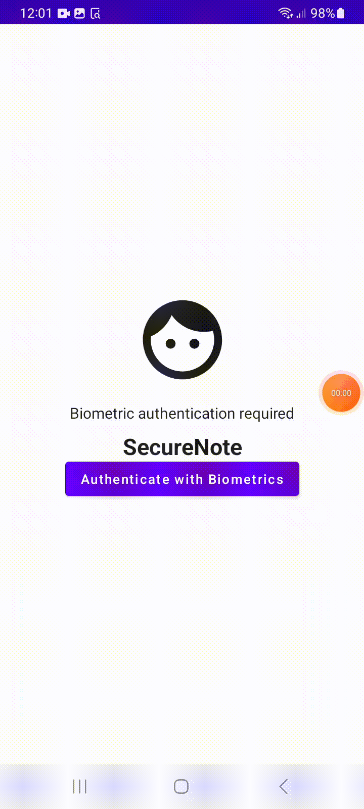

#  Secure Notes Mobile Assignment

Proyecto de un block de notas que permite hacer un CRUD, se registra con biometricos y guarda las notas en una DB local

## Approach :blush:

:star: Utilicé MVVM + Clean Architecture para facilitar el mantenimiento, mejorar la navegación en el proyecto, desacoplar el código y aumentar la legibilidad para el equipo.  
:star: Usé inyección de dependencia para promover el desacoplamiento y la capacidad de prueba.

    |── app\
        |── ui\
            Contiene los componentes de la interfaz de usuario, pantallas y ViewModels.
                |── components\
                |── screens\
                |── viewmodels\
        |── domain\
            Aqui se encuentran los use cases y el repositorio.
                |── usecases\
                |── repositories\
        |── data\
            Alberga módulos para la inyección de dependencias y la base de datos.
                |── db\
                |── di\
        |── utils\
            Incluye utilidades y funciones de extensión, así como la base de los biométricos.

## Some Used Libraries :books:

:blue_book: [Hilt](https://developer.android.com/training/dependency-injection/hilt-android)  -> Para la inyección de dependencias, asegurando un código más limpio y menos acoplado.  
:green_book: [Room](https://developer.android.com/training/data-storage/room) -> Proporciona una capa de abstracción sobre SQLite para almacenar datos de manera eficiente y estructurada.  
:orange_book: [Jetpack Compose](https://developer.android.com/jetpack/compose) -> Para construir interfaces de usuario modernas, flexibles y concisas.  
:blue_book: [Navigation](https://developer.android.com/guide/navigation) -> Facilita la navegación entre diferentes componentes y pantallas en la aplicación.  
:green_book: [MockK](https://mockk.io/) -> Para realizar mocks en los tests, facilitando el testing de componentes individuales.

## TODOs :pushpin:

:gear: Implementar más pruebas sobre todo de integración
:gear: Ampliar las funcionalidad para permitir a los usuarios cargar o escribir archivos JSON para crear notas, asegurando flexibilidad y funcionalidad extendida.

## How to Run :rocket:

1.  Clona el repositorio en tu máquina local usando `git clone <URL del repositorio>`.
2.  Abre el proyecto en Android Studio.
3.  Sincroniza el proyecto con Gradle Files haciendo clic en `File` > `Sync Project with Gradle Files`.
4.  Ejecuta la aplicación en un emulador o dispositivo físico haciendo clic en `Run` > `Run 'app'`.

## Demo :movie_camera:

